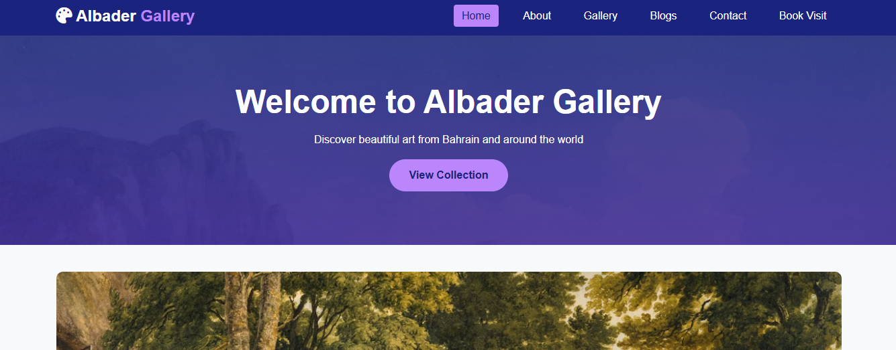

# Albader Gallery Website

## 🎯 Project Overview
**Course:** Technology Class Project  
**Teacher:** Mr. Nkwa Walkers  
**Student:** Bader Aljaberi
 
**Project Type:** Multi-page Art Gallery Website  

## 📋 Project Description
A professional, multi-page website for "Albader Gallery" - a fictional art gallery in Riffa, Bahrain. This project demonstrates advanced web development skills including multi-page navigation, responsive design, forms, and professional styling.

## ✨ Key Features
- ✅ **6-Page Website** - Complete navigation system
- ✅ **Responsive Design** - Mobile-first approach
- ✅ **CSS Grid Layout** - Modern layout techniques
- ✅ **Interactive Forms** - Contact form with validation
- ✅ **Professional Color Scheme** - Purple/blue theme
- ✅ **Font Awesome Icons** - Enhanced user interface
- ✅ **Cross-browser Compatibility** - Works on all modern browsers

## 🛠 Technologies Used
- **HTML5** - Semantic markup structure
- **CSS3** - Advanced styling with Grid and Flexbox
- **Font Awesome 6** - Icon library
- **JavaScript** - Form validation and interactivity
- **Unsplash API** - High-quality images

## 📁 Project Structure
albader-gallery-website/
│
├── index.html # Home page
├── about.html # About us page
├── gallery.html # Art gallery page
├── blogs.html # Blog page (planned)
├── contact.html # Contact page with form
├── appointment.html # Booking page
├── style.css # Main stylesheet
├── README.md # Documentation
├── LICENSE # MIT License
├── requirements.txt # Project requirements checklist
│
└── images/ # Image assets
├── screenshot.png # Website preview

## 🚀 How to View
1. **Online:** Open `index.html` in any web browser
2. **Local:** Download all files and open `index.html`

## 🎨 Design Choices
- **Primary Color:** `#1a237e` (Deep Blue) - Represents creativity and depth
- **Accent Color:** `#bb86fc` (Light Purple) - Adds artistic flair
- **Typography:** Clean, readable sans-serif fonts
- **Layout:** Grid-based for flexibility

## 📚 Educational Objectives Met
1. **Multi-page Website Structure**
2. **CSS Grid & Flexbox Layouts**
3. **Form Design & Validation**
4. **Responsive Web Design**
5. **Professional Documentation**
6. **Project Planning & Implementation**

## 🇧🇭 Bahraini Cultural Elements
- Bahraini pricing (BHD)
- Riffa, Bahrain location
- Arabic art and calligraphy themes
- Local cultural references

## 👨‍🏫 Notes for Reviewer
- All code written by student (no AI-generated content)
- Images from Unsplash (properly attributed)
- Complete project with 6 interconnected pages
- Demonstrates understanding of web development concepts

## 📄 License
MIT License - See LICENSE file

## 🙏 Acknowledgments
- **Teacher:** Mr. Nkwa Walkers for guidance
- **Unsplash** for high-quality images
- **Font Awesome** for icons
